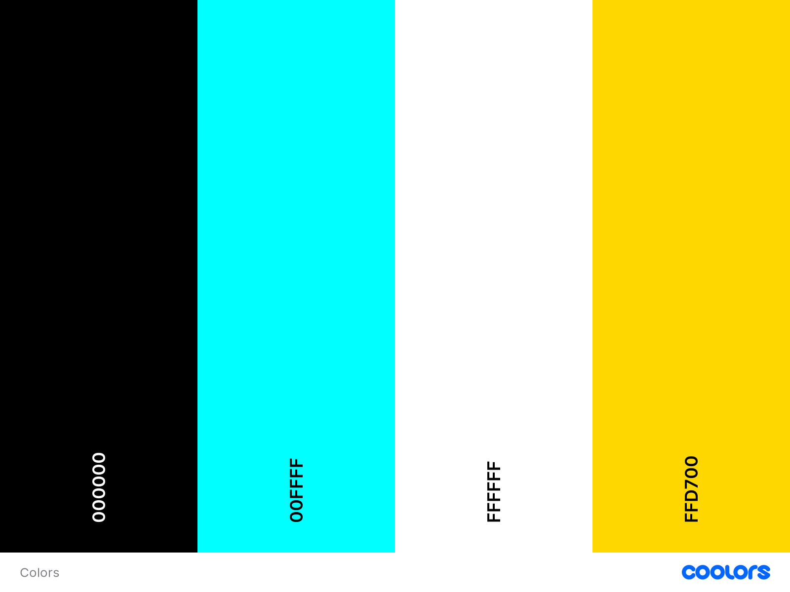
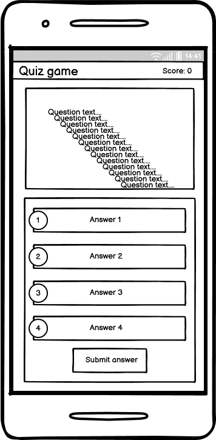
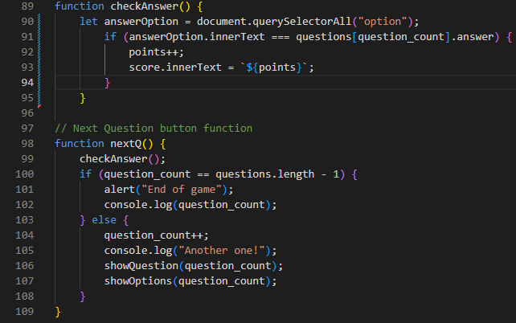
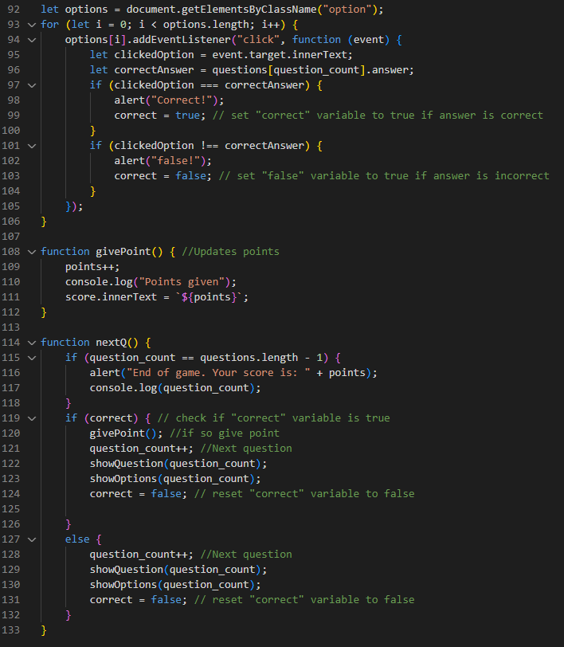
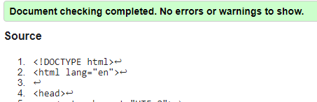
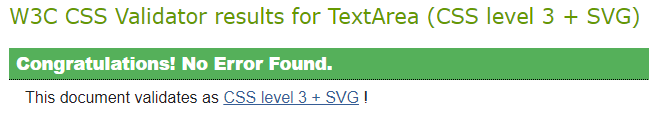
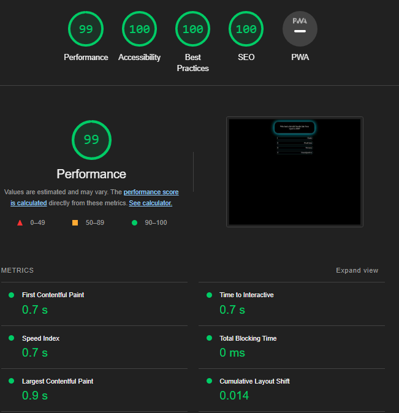
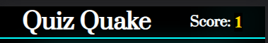

# Quiz Quake - Portfolio Project 2. By Patric Svedberg

<br>
Imaged made using [https://ui.dev/amiresponsive](https://ui.dev/amiresponsive)

## Table of Content:

* [Pages](#pages)
    * [Index](#index)
* [User Experience](#UX)
    * [User Demographics](#Demographics)
    * [Design](#Design)
    * [Controls](#controls)
* [Design](#Design)
    * [Color Scheme](#Color)
    * [Typography](#Typography)
    * [Wireframe](#Wireframe)
* [Technologies Used](#Technologies-Used)
    * [Software Used](#software-used)
    * [Languages Used](#Languages-used)
* [Testing](#Testing)
    * [Lighthouse](#Lighthouse)
    * [Validators](#Validators)
* [Features](#Features)
     * [Header and Navigation](#Header-and-Navigation)
     *  [Footer](#Footer)
     * [Index](#Index-page)
     * [Features Implemented](#features-implemented)
     * [Features Left to Implement](#Features-Left-to-Implement)
* [Thanks to](#thanks-to)

    # Pages:
    ## Index:
    There is only one page, but 3 different divs and sections are activated and deactivated inside it.

* The Tutorial div:
* What the player i greeted with. It was a small explanation of the game and how to play it. At the buttom of the div there is a "continue" button that closes the div and opens the game-container.
    


* Here the user can pick one of two categories. 90's music and space <br>


* The Game-container section:
* In this quiz, the player is presented with four possible answers and is required to pick the correct one. After selecting an answer the next-button appears. After answering the last question the game-container closes and the end game div opens.


                


* The end game screen. Here the final score is presented.<br/>


# UX
## Demographics:
* Anybody who likes to play quizes
# Design
I wanted to have everything on one page and the game should be intuitive.
# Controls
The controls is just point and click for both mobile and desktop/laptop.

## Color:
I wanted to have a darker theme to make it easier on the eye and also making it look a bit more modern in my opintion. The text is white and gold to make it easy to see on the dark background. The glowing turquoise borders is ment to give a neon feeling.

Imaged made using [Coolers](https://coolors.co/)

## Typography:
This site uses the fonts: <br /> 
**[Anton - Regular 400](https://fonts.google.com/specimen/Anton?query=anton) <br />**
**[Prata - Regular 400](https://fonts.google.com/specimen/Prata?query=prata) <br />**

## Wireframe:
This is what i scetched up before I started coding.
<br/>


# Technologies Used:

## Software Used
* Gitpod
* Github
 * Google Chrome Dev Tool

## Languages Used:
* HTML
* CSS
* JavaScript
<br />
<br />

# Testing:

* 2023-03-21: The question_count did not change the question when clicking the next question-button, even though the console.log showed that it incremented with +1 for every click on the button.
    I had forgot to return the new value to the funtion that displays the question and answers.

    ```function nextQ() {
        if (question_count == questions.length - 1) {
            alert("End of game");
            console.log(question_count);
        } else {
            question_count++;
            console.log("Another one!");
            showQuestion(question_count); // Forgot about this
            showOptions(question_count); // ...and this
        }
    };
    ```
* 2023-03-21: Manage to increment the score when going the next question, problem is that it always gives a score even if you've picked the wrong answer.
* 2023-03-22: Fixed the scoring. I made a boolean to trigger if the player clicked on the correct answer, and false if incorrect.<br<br>
## Old code:


## New code:
´

* 2023-03-23: Manage to make use key "5" to go to next question if a answer is selected. Have not manage to select questions with key 1-4.

* 2023-03-23: Manage to select answers with keys 1-4 (I think). But have not manage to make the psudo class "hover" or "active" to trigger.

* 2023-03-23: Found bug where no points is given if answering the last question correct. - FIXED


## Validators:
* ### HTML Validator:


* ### CSS:



## Lighthouse:

     
# Features

## Header
* The header has the game logo and the scoreboard. <br>


## Footer


## Index Page
* The index page is i collected everything. Tutorial, quiz and end screen.

## Features Implemented:
* Tutorial page
* Able to pick 1 of 4 answer for each questions
* Next question button appears if you pick a question only
* Gives a score if correct and adds it to the scoreboard at the top right corner
* When finished the game an end screens appears and gives you the final score and the ability to play again

## Features Left to Implement:
* More questions categories
* More questions for every catergory
* Using keyboard to pick questions
* Animations
* Submit score

## Thanks to:
* Got some help from this video by [PRAROZ](https://youtu.be/1ydfKDwsYbU)
* [W3schools](https://www.w3schools.com/js/)
* [Stack Overflow](https://stackoverflow.com/questions/tagged/javascript)
* Code Institute Tutor Assistance
* Lauren-Nicole Popich - My mentor. For helpt end encouragement!

