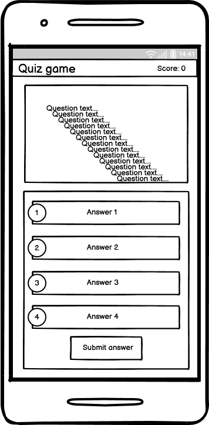

# Quiz Quake - Portfolio Project 2. By Patric Svedberg

## Table of Content:

* [Pages](#pages)
    * [Index](#index)
* [User Experience](#UX)
    * [User Demographics](#Demographics)
    * [Design](#Design)
    * [Controls](#controls)
* [Design](#Design)
    * [Color Scheme](#Color)
    * [Typography](#Typography)
    * [Wireframe](#Wireframe)
* [Technologies Used](#Technologies-Used)
    * [Software Used](#software-used)
    * [Languages Used](#Languages-used)
* [Testing](#Testing)
    * [Notes](#Notes)
    * [Lighthouse](#Lighthouse)
    * [Validators](#Validators)
* [Features](#Features)
     * [Header and Navigation](#Header-and-Navigation)
     * [Index](#Index)
     * [Features Left to Implement](#Features-Left-to-Implement)
* [Content](#Content)
    * [Content](#Inspirations)
    * [Media](#Media)
    * [Acknowledgments](#Acknowledgments)

    # Pages:
    ## Index:
    In this quiz, the player is presented with four possible answers and is required to pick the correct one.

    # UX
    ## Demographics:
    * Anybody who likes to play quizes
    # Design
    I wanted to have everything on one page and the game should be intuitive.
    # Controls
    The controls is just point and click for both mobile and desktop/laptop. When using a keyboard the player should aslo be able to
    choose an answer using the keys 1-4 and confirm the answer with 5.

    ## Color:
    I wanted to have a darker theme to make it easier on the eye and also making it look a bit more modern in my opintion.

    ## Typography:
    Default font at this moment

    ## Wireframe:

    

    # Technologies Used:

    ## Software Used
    * Gitpod
    * Github
    * Google Chrome Dev Tool

    ## Languages Used:
    * HTML
    * CSS
    * JavaScript
    <br />
    <br />

    # Testing:

    * 2023-03-21: The question_count did not change the question when clicking the next question-button, even though the console.log showed that it incremented with +1 for every click on the button.
    I had forgot to return the new value to the funtion that displays the question and answers.

    ```function nextQ() {
        if (question_count == questions.length - 1) {
            alert("End of game");
            console.log(question_count);
        } else {
            question_count++;
            console.log("Another one!");
            showQuestion(question_count); // Forgot about this
            showOptions(question_count); // ...and this
        }
    };
    ```
    * 2023-03-21: Manage to increment the score when going the next question, problem is that it always gives a score even if you've picked the wrong answer.

    ## Notes:

    * 

    ## validators:

    * 

     ## Lighthouse

     
     # Features

     ## Header
     * The header has the game logo and the scoreboard .

     ## Index
     * The index page is where the quiz is.

     ## Features Left to Implement:
     * More questions categories
     * More questions for every catergory
     * Animations
     * Submit score

     <br />

    # Content
    ## Media:
    The social media icons were taken from [Font Awesome](https://fontawesome.com/)
    
    ## Inspirations and help:
    * Got some help from this video by [PRAROZ](https://youtu.be/1ydfKDwsYbU)

    # Acknowledgments:

    ## Thanks to:
    ### Lauren-Nicole Popich
    * My mentor. For helpt end encouragement!
